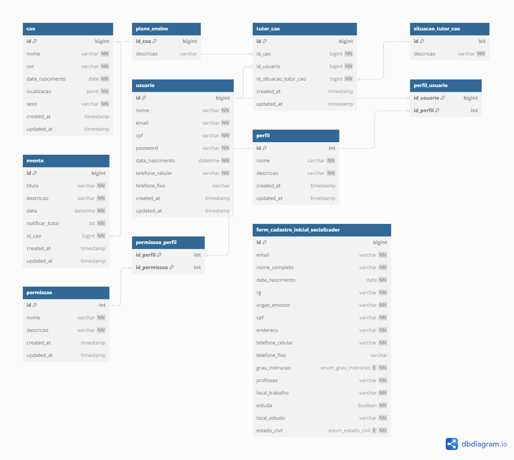

## Sumário
- [Sumário](#sumário)
- [📍 Intro](#-intro)
- [💾 Modelo de banco de dados](#-modelo-de-banco-de-dados)

## 📍 Intro

Neste documento encontra-se todos os arquivos pertinentes a documentação do projeto [Escola de cães-guia Hkeller](../README.md)

## 💾 Modelo de banco de dados



Este modelo foi criado com [dbdiagram.io](https://dbdiagram.io). Para editá-lo basta copiar o código abaixo e inseri-lo no dbdiagram.

```dbml
Table cao {
  id bigint [pk,increment]
  nome varchar [not null]
  cor varchar [not null]
  data_nascimento date [not null]
  localizacao point [not null]
  id_genero varchar [not null, ref: > genero.id]
  created_at timestamp [default: `now()`]
  updated_at timestamp [default: `now()`]
}

Table genero {
  id bit [pk,increment]
  descricao varchar [not null]
}

Table plano_ensino {
  id_cao bigint [pk, ref: - cao.id]
  descricao varchar
}

Table tutor_cao {
  id bigint [pk, increment]
  id_cao bigint [not null, ref: > cao.id]
  id_usuario bigint [not null, ref: > usuario.id]
  id_situacao_tutor_cao bigint [not null, ref: > situacao_tutor_cao.id]
  created_at timestamp [default: `now()`]
  updated_at timestamp [default: `now()`]
  
  Note: 'Estrutura para de relação entre um usuário e um cao. Esta relação possuirá uma situação ativa ou inativa, sendo que poderá existir somente uma relação ativa por vez entre cao e usuário.'
}

Table situacao_tutor_cao {
  id bit [pk, increment]
  descricao varchar [not null]
  
  Note: 'Representa a situação atual da relação do tutor com o cão, podendo esta relação estar ativa ou inativa.'
}

Table evento {
  id bigint [pk,increment]
  id_evento bigint [not null, ref: > tipo_evento.id]
  descricao varchar [not null]
  data datetime [not null]
  notificar_tutor bit [not null, default: 0]
  id_cao bigint [not null, ref: > cao.id]
  created_at timestamp [default: `now()`]
  updated_at timestamp [default: `now()`]
  
  Note: 'O campo "data" representa qual a data do evento, devendo o próprio usuário informá-la. Quando for exibido em formato de notificação para o tutor, basta buscar os eventos >= data atual. Quando for exibido em histórico basta buscar todos os eventos.'
}

Table tipo_evento {
  id bigint [pk,increment]
  descricao varchar [not null]
}

Table usuario {
  id bigint [pk, increment]
  nome varchar [not null]
  email varchar [unique, not null]
  cpf varchar [unique, not null]
  password varchar [not null]
  data_nascimento datetime [not null]
  telefone_celular varchar [not null]
  telefone_fixo varchar
  created_at timestamp [default: `now()`]
  updated_at timestamp [default: `now()`]

  Note: 'Email e cpf poderão ser utilizados como login, pois são chaves únicas.'
}

Table perfil {
  id int [pk, increment]
  nome varchar [not null]
  descricao varchar [not null]
  created_at timestamp [default: `now()`]
  updated_at timestamp [default: `now()`]
}

Table perfil_usuario {
  id_usuario bigint [pk, ref: > usuario.id]
  id_perfil int [pk, ref: > perfil.id]
}

Table permissao {
  id int [pk, increment]
  nome varchar [not null]
  descricao varchar [not null]
  created_at timestamp [default: `now()`]
  updated_at timestamp [default: `now()`]
}

Table permissao_perfil {
  id_perfil int [pk, ref: > perfil.id]
  id_permissao int [pk, ref: > permissao.id]
}
```
